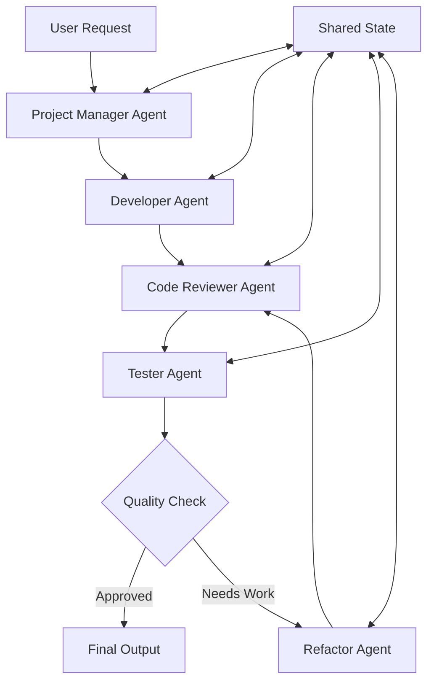

<!-- @format -->

# 🏗️ Agent Architecture & Interaction Design

## 🔄 Multi-Agent System Design

### Architecture Overview

DevGenius implements a **pipeline-based multi-agent architecture** with
**feedback loops** and **quality gates**. Each agent is specialized for a
specific domain while maintaining the ability to collaborate through shared
state management.



## 🤖 Individual Agent Specifications

### 1. Project Manager Agent (`project_manager_node`)

**Responsibilities:**

- Requirements analysis and decomposition
- Task specification creation
- Acceptance criteria definition
- Scope management

**Input Schema:**

```python
{
    "task": str,  # Raw user request
    "messages": List[BaseMessage]
}
```

**Processing Logic:**

- Analyzes user intent and complexity
- Breaks down requirements into actionable tasks
- Defines clear acceptance criteria
- Creates structured specifications

**Output Schema:**

```python
{
    "task": str,  # Refined task description
    "messages": List[BaseMessage]  # Updated message history
}
```

**Specialized Prompting:**

- Focuses on business analysis techniques
- Emphasizes clarity and actionability
- Includes stakeholder perspective considerations

### 2. Developer Agent (`developer_node`)

**Responsibilities:**

- Code architecture design
- Implementation of core functionality
- Best practice application
- Documentation creation

**Input Schema:**

```python
{
    "task": str,  # Detailed task specification
    "code": str,  # Previous code (if iterating)
    "messages": List[BaseMessage]
}
```

**Processing Logic:**

- Analyzes technical requirements
- Designs appropriate code structure
- Implements functionality with best practices
- Ensures code readability and maintainability

**Output Schema:**

```python
{
    "code": str,  # Generated Python code
    "messages": List[BaseMessage]
}
```

**Specialized Prompting:**

- Emphasizes clean code principles
- Focuses on Python best practices
- Includes performance considerations

### 3. Code Reviewer Agent (`reviewer_node`)

**Responsibilities:**

- Static code analysis
- Security vulnerability assessment
- Performance optimization suggestions
- Coding standard compliance

**Input Schema:**

```python
{
    "code": str,  # Code to review
    "task": str,  # Original requirements
    "messages": List[BaseMessage]
}
```

**Processing Logic:**

- Performs comprehensive code analysis
- Identifies potential security issues
- Checks for code smells and anti-patterns
- Suggests performance improvements

**Output Schema:**

```python
{
    "review": str,  # Detailed review feedback
    "messages": List[BaseMessage]
}
```

**Specialized Prompting:**

- Security-focused analysis
- Performance optimization lens
- Code quality metrics emphasis

### 4. Tester Agent (`tester_node`)

**Responsibilities:**

- Test case design and creation
- Unit test implementation
- Test execution and validation
- Coverage analysis

**Input Schema:**

```python
{
    "code": str,  # Code to test
    "task": str,  # Requirements for test design
    "messages": List[BaseMessage]
}
```

**Processing Logic:**

- Analyzes code for testable components
- Designs comprehensive test cases
- Implements pytest-based test suites
- Executes tests and analyzes results

**Output Schema:**

```python
{
    "test_results": str,  # Test execution results
    "messages": List[BaseMessage]
}
```

**Specialized Prompting:**

- Test-driven development focus
- Edge case identification
- Comprehensive coverage goals

### 5. Refactor Agent (`refactor_node`)

**Responsibilities:**

- Code improvement and optimization
- Issue resolution based on feedback
- Integration of review suggestions
- Final quality assurance

**Input Schema:**

```python
{
    "code": str,  # Original code
    "review": str,  # Review feedback
    "test_results": str,  # Test outcomes
    "iterations": int,  # Current iteration count
    "messages": List[BaseMessage]
}
```

**Processing Logic:**

- Synthesizes feedback from multiple sources
- Prioritizes critical issues
- Applies refactoring patterns
- Maintains functionality while improving quality

**Output Schema:**

```python
{
    "code": str,  # Improved code
    "iterations": int,  # Updated iteration count
    "messages": List[BaseMessage]
}
```

**Specialized Prompting:**

- Refactoring pattern expertise
- Integration focus
- Quality improvement emphasis

## 🔄 Inter-Agent Communication

### State Management System

```python
class AgentState(TypedDict):
    task: str                    # Current task description
    code: str                    # Working code artifact
    review: str                  # Review feedback
    test_results: str           # Test execution results
    iterations: int             # Iteration counter
    max_iterations: int         # Iteration limit
    final_code: str            # Approved final code
    messages: List[BaseMessage] # Communication history
```

### Communication Protocol

**1. Sequential Processing**

- Each agent processes in predetermined order
- State updates passed to next agent
- Maintains context throughout workflow

**2. Feedback Integration**

- Review feedback influences refactoring
- Test results guide improvements
- Iterative refinement process

**3. Quality Gates**

- Decision points based on agent outputs
- Automated quality assessment
- Configurable approval criteria

### Workflow Control Logic

```python
def should_continue(state: AgentState) -> str:
    """Decision logic for workflow continuation"""
    if state['iterations'] >= state['max_iterations']:
        return "end"  # Max iterations reached

    review = state.get("review", "").lower()
    test_results = state.get("test_results", "").lower()

    # Quality gate conditions
    if ("no issues found" in review and
        "tests failed" not in test_results and
        "error" not in test_results):
        return "end"  # Quality standards met
    else:
        return "refactor"  # Continue improvement
```

## 🎛️ Orchestration Framework

### LangGraph Implementation

- **StateGraph**: Manages agent workflow
- **Conditional Edges**: Dynamic routing based on outcomes
- **State Persistence**: Maintains context across transitions
- **Error Handling**: Graceful failure management

### Workflow Execution

1. **Initialization**: Create initial state with user request
2. **Sequential Processing**: Execute agents in defined order
3. **Decision Points**: Evaluate continuation criteria
4. **Iteration Management**: Control refinement cycles
5. **Finalization**: Deliver approved output

### Performance Optimizations

- **Lazy Loading**: Agents loaded on demand
- **State Compression**: Efficient state management
- **Parallel Processing**: Independent operations when possible
- **Resource Pooling**: Efficient LLM usage

## 🔧 Technical Implementation Details

### Agent Isolation

- Each agent runs in isolated context
- No direct agent-to-agent communication
- State-mediated interaction only
- Prevents interference and ensures reliability

### Error Handling Strategy

- **Graceful Degradation**: Continue with warnings
- **Retry Mechanisms**: Automatic retry on transient failures
- **Fallback Strategies**: Alternative approaches on failures
- **User Feedback**: Clear error communication

### Scalability Considerations

- **Stateless Agents**: Easy horizontal scaling
- **Modular Design**: Independent agent deployment
- **Resource Management**: Efficient LLM utilization
- **Load Balancing**: Distribute requests across instances
